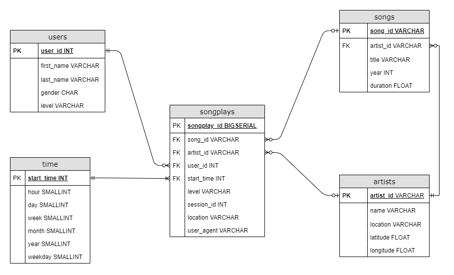

# Sparkify Database for analysing music listening behavior

This application creates and fills a database with data logging users' music listening behaviour on Sparkify's streaming app. The database can then be used by analysts to extract insights about users' behaviour.

The data comes from two sources:
- song files containing data regarding songs and artists
- log files containing data about users and which songs they listened to

This is an OLAP-focused application, so a star-schema is used with weak normalization, The relational schema looks as follows:



## Project structure
- `data` -> contains the raw json data files which are parsed and inserted into the DB
- `create_tables.py` -> contains code for creating the database schema
- `sql_queries.py` -> contains the actual SQL queries for creating the database schema
- `etl.py` -> parses the json files in the `data` directory and inserts them into the DB
- `etl.ipynb` -> testing for the functionality of the etl pipeline on a sample of files
- `test.ipynb` -> testing for the creation of the tables and insertion of the data


## Running the Pipeline

To run the ETL pipeline, you'll first need to create the database schema using:

```
python create_tables.py
```

And then run the parsing and data insertion pipeline:
```
python etl.py
```


## Example queries:

- How many songs were played during the 3rd of November 2019:
```
SELECT Count(*) AS num_listens
FROM songplays
JOIN time ON songplays.start_time = time.start_time
WHERE 
    time.day = 3
    AND time.month = 11 
    AND time.year = 2018
```

- Get a list of the most popular artists and how many times users listened to their songs:
```
SELECT artists.artist_id, artists.name, Count(*) AS num_listens
FROM songplays
JOIN artists ON songplays.artist_id = artists.artist_id
GROUP BY artists.artist_id, artists.name
ORDER BY num_listens
LIMIT 100
```

- Get a list of the top users in terms of song plays
```
SELECT users.user_id, users.first_name, users.last_name, users.level, Count(*) as num_listens
FROM songplays
JOIN users ON songplays.user_id = users.user_id
GROUP BY users.user_id, users.first_name, users.level
ORDER BY num_listens DESC
LIMIT 100
```

- Get the number of song plays grouped by the day of the week
```
SELECT time.weekday, Count(*) as num_listens
FROM songplays
JOIN time ON songplays.start_time = time.start_time
GROUP BY time.weekday
ORDER BY time.weekday
```

You can use the [Dashboard notebook](./dashboard.ipynb) to issue ad-hoc queries once you are done setting up the Database.
