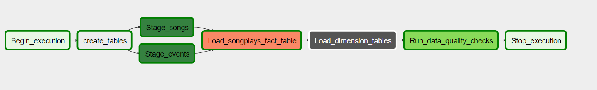

# Song Analysis Pipeline using Airflow

The aim of this project is to read raw json data representing web log data and song data from S3 and creating a dimensional model out of them in order to facilitate further analysis. The ETL pipeline is implemented using Airflow.

The DAG proceeds as follows:
1. Create the staging and final dimensional tables in Redshift 
1. Read Data from S3 into the redshift staging tables
1. Load the data from the staging tables to the dimensional model tables
1. Run data quality checks to make sure the loaded data is fit for purpose. Checks include
	- Rudimentary size checks to make sure the data was actually loaded
    - Non-nullity checks for important columns to make sure further analysis is sound. This can also be enforced on the database level if needed
    - Validation checks for column values to make sure they make sense

## Instructions

1. **Create the infrastructure**

    For this project we'll need an AWS Redshift cluster with a corresponding role allowing it to read from S3 buckets. Fill out the AWS credentials in the `aws.cfg` and the redshift details in `dwh.cfg` (leave the `CLUSTER.host` and `IAM_ROLE.arn` empty, they will be filled out automatically. The user whose credentials you place in the `aws.cfg` should have the rights to create redshift clusters and roles. To create the infrastructure, run:

		python create_infra.py

1. **Add the connections to Airflow**

    The project uses two hooks to connect to S3 and Redshift:

    - `aws_credentials`: Connection of type **Amazon Web Services**, used to read data from the S3 bucket into redshift. This user needs to have a role with the principal being redshift and the policy to read from S3 buckets. This user should optimally be a different user than the one you entered above during the infrastructure creation in order to follow the **Least Privilege** principle, because he doesn't need as much authorization as the user creating the DWH. You'll need to fill out the "Login" and "Password" fields with the AWS Access Key ID and Secret Access Key for this user

    - `redshift`: Connection of type **Postgres**, used to create tables in Redshift. You'll need to fill out the host, schema, login, password and port fields with the corresponding values in the `dwh.cfg` file

1. **Run the Airflow DAG**

    Open up the Airflow UI and trigger the DAG

1. **Delete the infrastructure**

    Once you are done with the analysis, delete the Redshift cluster to avoid any unneeded costs

		python delete_infra.py
        
## DAG Structure

The Dag looks as follows

We use a sub-dag for loading the dimension tables to make the pipeline easier to understand
