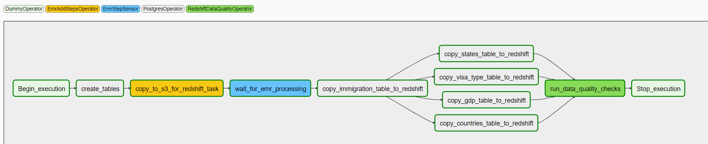

# Udacity Capstone Project

## Project Description

The purpose of this project is to create an infrastructure to enable the ad-hoc analysis of patterns of entry to the United states using immigration data, as well as creating a machine learning model based on this data to enable the user to predict the probability that a specific passenger with some features would overstay his visa.

## Data Sources

- U.S immigration data from 2016 provided in SAS format. Contains records of arrivals of non-immigration passengers including information about their demographics, the kind of visa they were admitted with, and how they arrived
- Country GDP data ([Source](https://datahub.io/core/gdp/r/gdp.csv)): Contains yearly GDP data for all countries
- Country Codes data ([Source](https://github.com/lukes/ISO-3166-Countries-with-Regional-Codes/blob/master/all/all.csv)): Simple listing of countries containing their ISO-2 and ISO-3 codes, names and continents
- States Codes Data ([Source](https://github.com/jasonong/List-of-US-States/blob/master/states.csv)): Simple listing of U.S. states with their codes and names

## Tools Used

- **Airflow**: for orchestrating and running the data pipelines
- **Spark / EMR**: for doing the heavy lifting of data transformation and copying
- **Redshift**: Serves as a final place to save the cleaned data saved as a start schema so that ad-hoc analysis can be easily performed
- **S3**: Serves as a staging ground between the different steps of the pipeline
- **Cassandra**: Used as a backend DB for the web application. Allows incredibly fast retrieval of data for specific queries. 
- **Cloudformation**: For automatic the provisioning and destruction of infrastructure
- **Sklearn**: for training an ML model for overstay prediction
- **Flask**: for creating a small web application for displaying statistics about the immigration data and allowing the user to interact with the ML model

## Data Flow

### Big Picture

### Steps Involved

#### Local Data Copy to an S3 Bucket

Airflow DAG Code: [./airflow/dags/copy_files_dag.py](./airflow/dags/copy_files_dag.py)

This step simply copies data stored locally and retrieved online into a raw data bucket in S3 so the next steps can all be performed using cloud tools. The data involved is:
- Immigration data: local
- Dimension data:
    - States Codes Data: local
    - Country Code Data: local
    - Country GDP Data: Download on the fly from the internet location and saved to S3

#### Data Cleanup and Preparation for Staging

Airflow DAG Code: [./airflow/dags/processing_dag_emr.py](./airflow/dags/processing_dag_emr.py)

This step takes care of cleaning the data and generating the staging data used for the next steps. It does [multiple transformations and cleanups](./spark/src/lib//processing.py) on the source immigration data and more importantly adds some derived fields that are used in the later steps.

Two data representations are generated by this step
- Star Schema representation: This is the representation intended to eventually be saved in Redshift. A star schema was chosen because it lends itself quite well for the use in ad-hoc analysis
- ML Data representation: single data frame containing all the data needed to traing the ML model

Both representations are written in the S3 Staging bucket at the end of this step

#### Train ML Model

Airflow DAG Code: [./airflow/dags/train_ml_model_dag.py](./airflow/dags/train_ml_model_dag.py)

This step uses the ML data saved in the staging bucket from the previous step and uses it to train an ML model using scikit-learn. The training happens on the driver of the EMR cluster, and one other option would have been the use of Spark ML for training the ML model. I decided against this option because my intention was to host this model on a web application and I didn't the web app to to have a dependency on the existence of a spark cluster.

#### Copy To Redshift

Airflow DAG Code: [./airflow/dags/copy_to_redshift.py](./airflow/dags/copy_to_redshift.py)

This step copies the data saved in the staging bucket to the Redshift cluster, using an intermediate JSON dump in S3, then a `COPY` command to Redshift. I tried to use jdbc in Spark to access the DB and 
insert directly into Redshift but it was seriously 2 orders of magnitude slower than using the `COPY` command, so I went with this solution.

#### Copy To Cassandra

Airflow DAG Code: [./airflow/dags/copy_to_cassandra.py](./airflow/dags/copy_to_cassandra.py)

This step copies the data saved in the staging bucket to the Cassandra cluster after transforming it to fit the queries that will be issued by the web application (the main client for the cassandra DB).

#### Web application

Web App Code: [./web/map_app/app.py](./web/map_app/app.py)

This is a simple web application that displays the data saved in cassandra on an interactive map, plus it uses the ML model trained previously to make live predictions for user inputs

## Data Dictionary

There are two final data sources for this project, the Redshift DB and Cassandra. They both share the same dimensional table structure, but differ in the fact table structure.

### Redshift

Schema: [./airflow/sql/create_tables.sql](./airflow/sql/create_tables.sql)

Tables

**immigration**: 

Fact Table

- **admnum** (BIGINT): unique identifier for passenger's admission, forms part of the primary key (*PK*)
- **arrival_date** (DATE): date of arrival of passenger, forms part of the primary key (*PK*)
- **country_citizenship** (VARCHAR(3)): 3-letter ISO code for the passenger's country of citizenship, forms part of the primary key (*PK*)
- **country_residence** (VARCHAR(3)): 3-letter ISO code for the passenger's current country of residence
- **destination_state** (VARCHAR(2)): 2-letter code for the passenger's destination state
- **age** (INT): passenger's age at the time of arrival
- **gender** (VARCHAR): passenger's gender
- **visa_type** (VARCHAR): type of visa the user was admitted with
- **num_previous_stays** (INT): number of times the passenger arrived and departed
- **unrestricted_stay** (BOOL): flag for whether the passenger has an unrestricted stay due to his visa type. Check [./notebooks/Data Exploration.ipynb](./notebooks/Data%20Exploration.ipynb) for details on how this field was derived
- **is_overstay** (BOOL): flag whether the passenger overstayed his visa. This is the target field for the ML model. Check [./notebooks/Data Exploration.ipynb](./notebooks/Data%20Exploration.ipynb) for details on how this field was derived
- **year** (INT): year component of the arrival date
- **month** (INT): month component of the arrival date
- **day** (INT): day component of the arrival date

**country**: 

Dimension Table

- **country_code** (VARCHAR(3)): 3-letter ISO code for the country
- **country_code_iso_2** (VARCHAR(2)): 2-letter ISO code for the country
- **country_name** (VARCHAR): country name
- **continent** (VARCHAR): continent for the country

**state**: 

Dimension Table

- **state_code** (VARCHAR(3)): 2-letter code for the state
- **state_name** (VARCHAR): state name

**visa_type**: 

Dimension Table
- **visa_type** (VARCHAR): code for the visa type
- **visa_category** (VARCHAR): general category for the visa type

**gdp**: 

Dimension Table
- **country_code** (VARCHAR(3)): 3-letter ISO code for the country
- **year** (INT): year that the GDP was recorded. We only keep the latest year for each country
- **gdp_value** (FLOAT): value for the GDP in dollars

### Cassandra

Schema: [./airflow/sql/cql](./airflow/sql/cql)

Tables

**immigration_stats**: 

Fact Table
- **country_code_iso_2** (TEXT): 2-letter ISO code for the country
- **year** (INT): year component of the arrival date
- **month** (INT): month component of the arrival date
- **day** (INT): day component of the arrival date
- **count** (INT): number of arrivals in this day

**country**: 

Dimension Table
- **country_code** (TEXT): 3-letter ISO code for the country
- **country_code_iso_2** (TEXT): 2-letter ISO code for the country
- **country_name** (VARCHAR): country name
- **continent** (VARCHAR): continent for the country

**state**: 

Dimension Table
- **state_code** (TEXT): 2-letter code for the state
- **state_name** (TEXT): state name

**visa_type**: 

Dimension Table
- **visa_type** (TEXT): code for the visa type
- **visa_category** (TEXT): general category for the visa type

**gdp**: 

Dimension Table
- **country_code** (TEXT): 3-letter ISO code for the country
- **year** (INT): year that the GDP was recorded. We only keep the latest year for each country
- **gdp_value** (FLOAT): value for the GDP in dollars

## Data Quality Checks

After the load to Redshift, we conduct some [size and validity checks](./airflow/plugins/operators/redshift_data_quality.py) on the [redshift](./airflow/dags/copy_to_redshift.py) data. We also have primary key constraints on all the [tables](./airflow/sql/create_tables.sql).

## Project Discussion

### Choice of tools

We use cloud (AWS) tools throughout the project which, aided with cloudformation, allows us to easily create and destroy infrastructure as needed.

**Airflow**: Used for managing the data pipelines instead of having to write python scripts to cobble together the different steps of each pipeline

**Redshift**: Relational database using SQL which is familiar for analysts, plus it uses a columnar storage, so very efficient for aggregations.

**Cassandra**: We first thought about using Redshift as the backend for our web app too, but it didn't seem like a good fit because a data warehouse is oriented towards ad-hoc offline kinds of queries and not simple repeated queries as is needed by the web app. Cassandra would be able to offer a much better throughput than Redshift, plus if the web app gets accessed by more and more people, the redshift cluster wouldn't have to be innundated by those queries and the cassandra cluster can be scaled independently.

**Spark/EMR**: We made a point to use Spark / EMR instead of using pandas for example to make sure that we have a scalable infrastructure that can transparently and cost-effectively handle an increase in the amount of data without having to rely on vertical scaling that will eventually become prohibitively expensive

**S3**: Cost-effective globally-reachable cloud storage allowing the saving of the intermediate states of our computational flow, so that all the different components (Airflow, Redshift, Spark) have a common source / destination and where the computation is occuring doesn't matter

### Data Update frequency

The immigration data should be updated daily, the ML model can probably be re-trained monthly without a loss of accuracy.

### Scenarios:

**Data Increased by 100x**: Due to the fact that we use AWS components in all our pipelines, we would only need to scale the processing capacity of our EMR and Redshift clusters (and possibly Cassandra, even though the data stored there is in aggregated form). This is easily doable using the [cloudformation templates](./infra/aws) provided 

**Daily Update**: We partition the data [by day when writing to S3](./spark/src/jobs/run_data_processin.py) and we use mode `overwrite` when saving, so doing partial updates and copies to Redshift and Cassandra should be quite easy, because the new partition will be added to S3, but it won't overwrite the old partitions

**Database needs to be accessed by 100+ people**: This will depend on the sort of queries these people will issue. If it's ad-hoc queries, we'll need to scale the Redshift cluster. If it's fixed queries (similar to what we have in the web app), then directing them to the cassandra cluster may be the best solution

## Installation and Running

Please check the [Installation Guide](./docs/installation_guide.md) for a step by step explanation of how to setup the infrastructure and run the different pipelines.